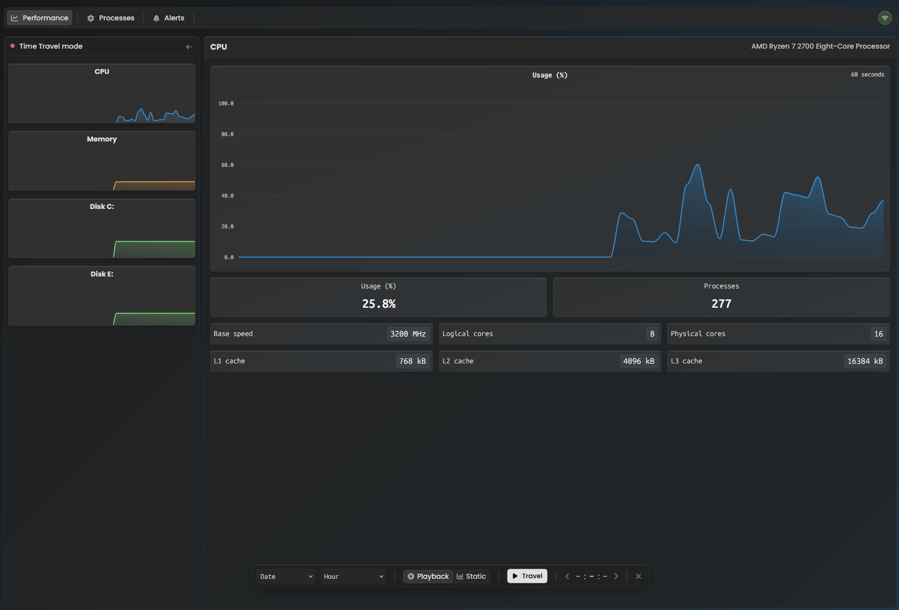

# Performance Monitor

Computer's performance monitoring app similar to the Window's Task Manager. 



### Getting started.

Environmental variables are stored in `.env` file. It is not present in the repository.
```env
DT-EnvId=aaa00000
DT-Logs=dt0000.AAAAAAAAAAAAAAAAAAAAAAAA.BBBBBBBBBBBBBBBBBBBBBBBBBBBBBBBBBBBBBBBBBBBBBBBBBBBBBBBBBBBBBBB
```

Installing python's dependencies.
```bash
pip install -r requirements.txt
```

Running Backend.
```bash
cd Backend
py server.py  (or python3 server.py)
```

### Monitors.

The monitors are defined in the `./Backend/monitors/` directory by creating a class inhereting from the `modules.monitor.MonitorBase`.
It contains: `target_title`, `product_info`, `hex_color` and `metrics_struct`.

The `metrics_struct` is a list of `KeyValueMetric`/`ChartMetric` or `MetricsRow`. This list sets the structure of metrics on the Frontend.


The order of imports in the `./Backend/monitors/__init__.py` sets the order on Frontend.

### Metrics.

A Metric can represent a Key-Value pair where key is name of observed asset (like `Processes`) or a chart.
Every Metric has it's own, unique identificator being set of the `categoryId` and `itemId`.
`KeyValueMetric`'s style can be changed by setting the `important_item`.

By default, all metrics are displayed in their own row. To group a few metrics in a single row, wrap them in the `MetricsRow` class.

##### Metrics - Getters.

Metric's getter is a function that returns a asset's value (like number of processes or usage of CPU).
There are two types of getters:

* **`AsyncReportingValueGetter`** - Used for a changing values like usage of CPU. This getter creates new thread that will check the output of getting function and if the value has changed, it **reports update** to the `state.UPDATES_BUFFER`. The getting function is called only if the output is needed - it's either displayed on the current page or it is a chart that needs constant updates.
Another thread (`modules.connection.updates_sender`) is checking every second for new reports in the `state.UPDATES_BUFFER`. If any changes has been reported, it packs them and sends to the Frontend WS client in single message. After calling getter for the first time it will report the value regardless app state to ensure placeholder will be changed with a value.

* **`StaticValueGetter`** - Used for a constant values. Value of this getter is included in the initial composition message.

    - *`lazy_static_getter`* - If obtaining an constant information takes too long, using this getter is recomended. Creates StaticValueGetter with a placeholder value, starts background evaluation job and immediately returns a blank getter, so the startup can continue without waiting for this value. When desired value is calculated in the background process, it reports itself to the `UPDATES_BUFFER` and the change is sent in the next updates packet. The value is also assigned to the previously created blank getter, so in case of Frontend's reconnection it doesn't have to be reevaluated.

### Connection.

1. Backend starts uvicorn WebSocket server on `50505` port.
2. Frontend connects to it.
3. The `initial composition` message is sent to client containing structure of metrics and static values.
4. Server sends a `update packet` containing all changed values every second.
5. If user changes page, a `change monitor` information is sent to the server, so it resume tracking assets on this new page and pause checking from the old page.
6. In case of Frontend's socket error, server disconnects from it and awaits new connection.

### Storing historical performance data.


